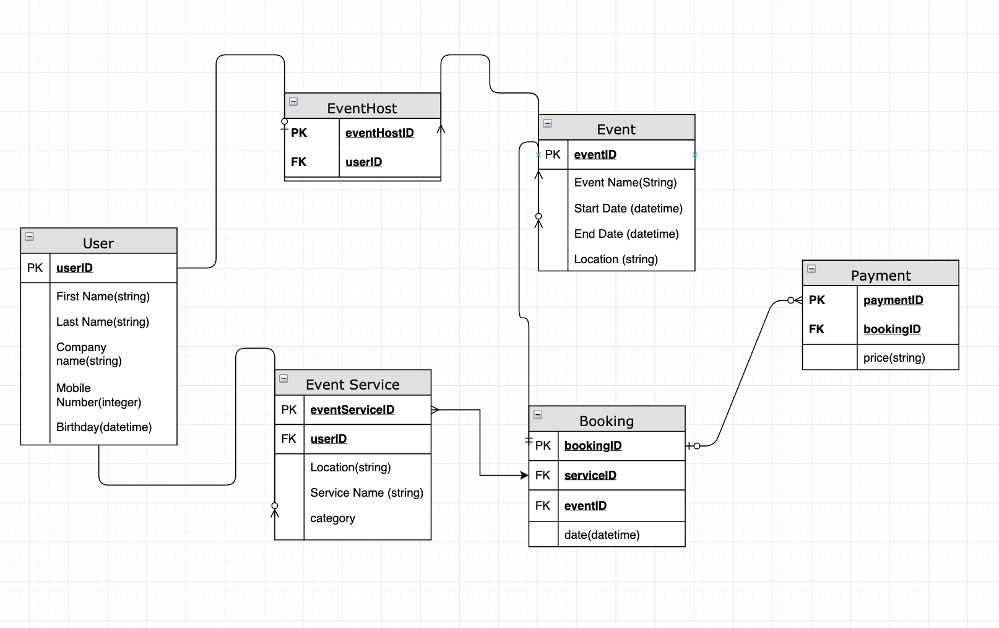

# Max Kelly - Work Book Answers 

### Q1: Describe the architecture of a typical Rails application

- A typical Rails application is broken up into a number of sections. 

1. The most acceptable area to start in a typical Rails application would be from the browser or client. When the user makes a request (clicks a new page) it sends a message to the web server passing it down through the dispatcher and onto the controller. The controller is also responsible for interacting with the models and views.
2. Before the data can be collected it must be passed through the controller. This is passed through as CRUDS (create, read, update and delete). The controller makes data available as needed. 
3. Once the CRUDS from the controller have been sent to the active record it then responds with either the data or errors. The Active Record is responsible for communicating with the database (sending queries) and then have the database send back either data or errors. In short the active record is responsible for communicating with the database connecting classes to relational database tables.
4. When the controller has received the data it then passes that information though to the "Model-View-Controller" pattern. This includes the: 
   - Views: Views are responsible for displaying and rendering the pages/data that the user is after. It represents the user interface, these files HTML files are also embedded Ruby code, allowing for a responsive and dynamic website.

    - Model: Models have the logic of the application and is responsible for manipulating the data as well as doing appropriate validations.
5. On top of the above a typical Rails application can also have "Railties" which is responsible for 'bringing everything together' an example of this is the command lines used to perform database tasks such as migrate, testing, and cleanups. 

### Q2: Identify a database commonly used in web applications (including Rails) and discuss the pros and cons of this database

- A database commonly used in web applications and especially Rails is PostgreSQL. The key advantages of this database is:

Pros: 

1. Code Comments: Unlike other databases PostgreSQL provides detailed code comments on what particular code does and what it doesn't do. It gives the developer a greater understanding of the design and will be able to follow and open up the engineering process. It also improves the community making it easier and friendlier for the developer can lead to great resources and better understanding of the systems.

2. Another advantage of PostgreSQL is the significant saving on cost. PostgreSQL is a open source free to use database and can be very beneficial to new developers, hobbyist or small businesses. 

Cons:

2. While PostgreSQL is open source and can lead to many more features from the community of developers it however does take a while to learn due to the sheer breadth and depth of the features. 

### Q3: Discuss the implementation of Agile project management methodology 200 - 300w

- Agile is a form of project management that is based around small and quick increments. Agile project management is most used around software development, it provides flexibility for changes to happen to the product as it continues to develop. These flexibilities allow the business to alter its course quickly based on how they see the customers reacting. The big difference Agile management has compared to others such as the waterfall method is that Agile development doesn't require one phase of a project to be completed before the next part can begin. 

To implement the agile project management there should typically be be at least four roles in the team. 1. The developers - They're responsible for building the product, testing and design. 2. Product manager - The project manager monitors the expectations of the stakeholders and directs the team to the feedback they're receiving. 3. Project facilitator - This person is responsible for working closely with the development team and ensure a consistent flow is happening and everyone is hitting their deadlines. 4. Finally there is the stakeholder these are internal and external customers while not participating in the development of the product but still playing a very large part by giving feedback and data to the business. Communication amongst the team if vital and often requires daily. Once roles have been defined the team would need to define daily sprints and deciding when each would be done whether that is 7 days, 14 days, 30 days or longer. 

In each sprint there should be the following stagings each not effecting the others time frame. 1. Plan - Planning from feedback what is the most important features needed to be built, 2. Design - A quick design on how the features will look on the site 3. Build - This is where the developers build out the feature as quickly as possible 4. Finally before release the team will test and ensure the feature is working as it should be. Once released the process repeats.

### Q4: Provide an overview and description of a standard source control process 100 - 200w

- Standard source control also referred to as version control is the ability to manage multiple people to simultaneously work on a single project. Each individual is able to edit their own source code and then choose when to share that with the wider group, thus partial edits by one person do not interfere with another persons work. It is also valuable to individuals on their own project as it allows them to work from multiple computers each sharing the same up-to-date code. 

Source control is particularly managed through Git which is a version control system and Github/Bitbucket which allows you and the team to view that code and manage the repositories in a friendly and collaborative way. A repository is a database of all the edits to, and/or past versions of your project. Once the user wishes to `push` to their repository they can do so, once on the repository they can then create a pull request to a other `branch` which then merges their code to the branch selected and updating it to combining their version with the branches. Eventually their code will make it to the `master` branch which has the finished work of each developer on the team. This repeats for each feature and/or work an individual does on the code.

### Q5: Provide an overview and description of a standard software testing process 100 - 200w

- While many organisations have slightly different standards to improve the quality of their software below is some general standards you can take to ensure the quality of your product is kept at a standard. There are a number of software testing programs such as IEEE 1059 - Which is testing and guiding of verification and validation of the software users. IEEE 730 is the standard to deal with the products quality and assurance and ensure that the product is up to a standard which the user can operate without any session ending bugs/issues. Finally the IEEE 12207 is the standard that guides in proper life cycle processes of both data and software. 

### Q6: Discuss and analyse requirements related to information system security 100 - 200w
- Information system security (INFOSEC) refers to the process of keeping information confidential, available and assuring its integrity. As well as this it also refers to and has relation to access controls and preventing unauthorized personnel from entering the system. Protecting all information and whatever state it is in e.g. an email or storage area, finally the detection and documentation of breaches in the system. The basic requirements for INFOSEC is:

  - Authentication and access control to users, this is ensuring that the users are authenticated and can only access the selected areas of the site. 
  - Third party vendor security, this is to ensure that any systems which you're using as a third party provider is protected and doesn't make your site vulnerable to external attacks along with this to also encrypt data such as keys and secret keys. 
  - Secure coding and application security, this involves the use of production, staging and testing development environments, handling errors in the correct way, implementing a two-factor authentication.

  The above is some example of the requirements related to INFOSEC and how you can improve the security of your site.

### Q7: Discuss common methods of protecting information and data 100 - 200w

- There a are a number of ways in which you can protect sensitive information within your site. The first step would be to do a risk assessment, the riskier the data the more protection it needs. Below are some examples of how you can protect your information.

1. Backups - Backups are a method  of preventing data loss that can often occur due to user error or technical malfunction/error. To ensure that the data is always protected backups should be made regularly. Data is what makes up a company and the loss of data can have a enormous effect on how it operates. 

2. Encryption - Encryption is another way in which you can prevent your data. However this way protects it from external forces such as hackers. High risk data is a target for hackers, however well-encrypted data is inherently safe from data breaches making it useless and irrecoverable to attackers. AIf a company has experienced a breach that affects encrypted data, you do not have to report it to authorities, since the data is considered protected. This example shows that encryption is the number one data security method.

3. Pseudonymisation - This method of keeping your data safe is recognized by GDPR (General Data Protection Regulation). Pseudonymisation consists of stripping identifying information from the data. For example you replace the names of persons, age etc... to randomly generated strings, as a result it becomes impossible to link together. This method is a must when performing scientific or statistical research. 

4. Finally we have access control. This is when only a select few have access to data. The fewer people that can access the data the less likely there will be an internal data breach or a loss in data. This however only protects you from the internal breaches and does not protect you from the external ones. 

### Q8: Research what your legal obligations are in relation to handling user data 100 - 200w

- If your site is collecting any personal information that can identify or reasonably identify the person then you will need to protect this information and obeyed by APP (Australian Privacy Principles). Some of this information includes name, signature, address, email, telephone number, date of birth, medical records, bank account details, photos, videos, place of work and more. 

To obeyed by APP you must implement practices and systems to ensure you can handle complaints from your users, must have up-to-date privacy policy, must give individuals access to their personal information on request, should not disclose personal information, must make users aware of a breach in their personal data. The above is the legal obligations which you must follow when collecting user data, this is enforced by the APP and Australia law. 

### Q9: Describe the structural aspects of the relational database model. Your description should include information about the structure in which data is stored and how relations are represented in that structure. 100 - 200w

- A relational database consists of a collection of tables each having a unique name. Within the table it has four columns ID, name, and age. While the other table consists of more information such as address, family, and salary. While the two tables are separate there can be a relationship between the two and that is shown by adding a new row to the first table and including a foreign key. This foreign key will represent the second table allowing the two to talk to each other and access the data. Two constraints relate to data integrity and the primary and foreign keys, entity integrity ensures that the primary key in the table is unique and not set to `null`. 

### Q10: Describe the integrity aspects of the relational database model. Your description should include information about the types of data integrity and how they can be enforced in a relational database. 100 - 200w

- Data integrity is the quality, accuracy and consistency of the data that is being passed into the database by the users. This also means the controlling what the user must enter to ensure the site functions as its meant to. Data integrity is broken up into three constraints. Referential integrity requires that every value in a foreign key column will be found in the primary key of the table from which it originated from. Entity Integrity states that every table must have its own primary key and that each has to be unique and not null. Finally domain integrity this states that all columns in a relational database are in a defined domain. However the two most important constraints when it comes to relational databases is Referential and Entity. 

### Q11: Describe the manipulative aspects of the relational database model. Your description should include information about the ways in which data is manipulated (added, removed, changed, and retrieved) in a relational database. 100 - 200w

- Data manipulation is used for adding, removing, changing and retrieving data in a database. One popular data manipulation language is Structured Query Language (SQL). SQL allows you to retrieve and manipulate data in a relational database. Data manipulation is broken up into four sections. 

1. `Adding` - This is allows the data to be inserted into the database across tables, taking data types such as strings, integers, booleans, datetime and many more. This is very useful in storing and displaying data across your site with relationships and more. Using relationships with adding allows you to link the data together and helps secure it, which leads us to out next section remove or delete.
2. `Delete` - Part of data manipulation is the ability to remove data from your database. This allows you to delete the record. However when using relationships within the data it allows you to prevent the deletion of a record if it is linked or requires another. This improves the quality of your database and ensure nothing gets removed that shouldn't be without the correct process. 
3. `Change/Updating` - This section of the database allows us to build responsive sites with up to date information which the user enters. 
4. Finally the last section is `retrieve`- This is allows you to obtain data from the database. The retrieved data may then be stored in a file, printed or viewed on the screen. 

### Q12: Identify and explain the workings of TWO sorting algorithms and discuss and compare their performance/efficiency (i.e. Big O) 300 - 500w

- Heapsort
  - Heapsort is a comparison-based algorithm that uses a binary heap data structure to sort elements. It divides its input into a sorted and an unsorted region, and it iteratively shrinks the unsorted region by extracting the largest element and moving that to the sorted region. We first start off with an unsorted array. From there we then transform that unsorted array into a heap. A heap is when the array is spread out over nodes and lines connecting each node together. It then involves you switching the nodes from the bottom to the top and then assigning them back to the array. The pros of heapsort is that it is very efficient and uses less memory because apart from what is necessary to hold the initial list of items to be sorted, it needs no additional memory space to work. Finally the last pro is consistency performing equally well across its best, average and worst cases. The cons however is it is unstable at times and might rearrange the relative order. Another disadvantage is its huge datasets, if your dataset is large and doesn't fit into memory it might have an effect on heapsort algorithms 
- Insertion Sort
  - The next algorithm is Insertion sort, this is a algorithm that works the way we sort playing cards. It is used when the number of elements is small, the idea is that one element from the input elements is consumed in each iteration to find its correct position. The pros of insertion sort is its simple implementation and simple understanding. Another pro is that is uses binary search variant for nearly sorted and sorted arrays resulting in a faster result compared to the standard version. However the biggest con is that it is slow for unsorted/reverse-sorted data. Another con is that it is less efficient on lists containing more number of elements, this also acts as a pro as it performs well in smaller databases and a lot more efficient. 

### Q13: Identify and explain the workings of TWO search algorithms and discuss and compare their performance/efficiency (i.e. Big O) 300 - 500w

- Linear Search
  - Linear search is when you iterate across an array, left - right which is then comparing it to the target element. Once the element matches the target element it returns the result. linear search best performs with smaller arrays and data when a key element matches the first element in the array the linear search is best case because the time it takes to execute is 0. However when you have a large array it can take a lot longer then other searching algorithms this is due to the fact that when you're dealing with larger data is can take a considerable amount of time to return the result seeing it is searching through each element in an array. An example of how this would look in pseudocode is: 
  
  starting at the first element: 
    if the first element is what you're looking for, stop. 
    otherwise, move to the next element.
  end 

- Jump Search 
  - Jump search is a searching algorithm for sorted arrays. The idea of jump search is to check fewer elements in the array (compared to linear search). This is done by jumping ahead or skipping elements instead of searching through all elements. Jump search improves efficiency buy limiting the number of elements the algorithm has to search for. However the down side of this that jump search still requires linear search to get the exact result, as linear search is best performed on smaller amount of elements. The below is an example of jump search

  Lets say we have an `array = [0, 1, 2, 3, 4, 5, 6, 7, 8, 9, 100, 144, 200, 240, 300, 700, 1000,]` and we want to find the value of 100. 
  The first step would be to jump from index of 0 to 4 
  The second step would be to jump from index of 4 to 8 
  The fourth step would be to jump from index of 8 to 12
  Since the element at index 12 is greater than 144 we will jump back a step to come to index 8
  The final stage when then be to use linear search to get the element.

  The reason we use linear search is that we have narrowed the search result down allowing linear search to perform at its best. 

### Q14: Conduct research into a marketplace website (app) and answer the following parts: 50 - 100 per part 
  a. What software is used by the app? 
  - The software which www.revelthat.com is using is React.js as its framework, Javascript, Node.js, MongoDB as a database. The version control that it is using is BitBucket.
  b. What hardware is used by the app?
  - Revel is across both mobile and desktop as well as tablet. Revel is AWS for its domain and heroku for its hosting and development. It also used Bitbucket to manage version control.  
  c. Describe the interaction of technologies within the app
  - Revel uses Stripe as a payment system this is done through Stripes connect feature. They also use AWS to host their domain and they deploy to Heroku. Along with this they have a number of other integrations such as Campaign monitor for email sending, mailgun, and Chatkit for an online messaging system.  
  d. Describe the way data is structured within the app
  - Firstly Revel has a table of users. The user table collects data such as First and last name, mobile number, email, company name(optional), password and more. Within the app there is also the event host and event service table allowing the user to select what role they want to play in the marketplace. For bookings and payment there is the event table allowing the event host to create events, the booking tables which allows the service to be booked for a particular event and finally the payment table which assigns the price and data for payment. 
  e. Identify entities which must be tracked by the app
  f. Identify the relationships and associations between the entities you have identified in part (e)
  - The relationships within Revel are: 
    - User table: Each user has one event service or event host. As well as every service and host must have a user assigned to it.  From there each event host or event service can have many events and the event service can have many bookings. Each booking then has many one payment with the serviceID and eventID assigned to it.
  g. Design a schema using an Entity Relationship Diagram (ERD) appropriate for the database of this website (assuming a relational database model)

  

#### References:

- https://adrianmejia.com/ruby-on-rails-architectural-design/
- https://www.greycampus.com/blog/project-management/implementing-agile-methodologies-in-traditional-project-management
- https://www.tutorialspoint.com/software_testing/software_testing_iso_standards.htm 
- https://safecomputing.umich.edu/information-security-requirements#DS18
- https://searchdatamanagement.techtarget.com/definition/relational-database
- https://brilliant.org/wiki/sorting-algorithms/
- https://www.geeksforgeeks.org/searching-algorithms/ 